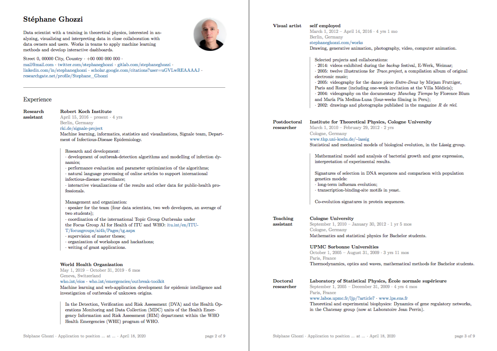

# Template for job application with CV

A LaTeX template for job applications:
- table of contents
- CV
- cover letter
- research summary
- referees

The template itself is [cv-application.tex](cv-application.tex) with the PDF output [cv-application.pdf](cv-application.pdf).

To generate the CV only, just remove the rest and the table of contents, and adapt the footer. See for example [cv-ghozzi.tex](cv-ghozzi.tex) and [cv-ghozzi.pdf](cv-ghozzi.pdf).

Overall the layout should also be adapted to the content to avoid as much as possible bad page breaks.

*First pages of the CV part of the application.*

 ## Features

 - layout inspired by LinkedIn's that emphasizes the occupations and positions (not the dates)
 - bibliography included
 - automatic timestamp in the footer
 - automatic computation of the duration of the current position
 - dates in the chosen format
 - page numbering

## Licence

The .tex file is made available under a [CC0](https://creativecommons.org/share-your-work/public-domain/cc0/) licence, i.e. others may freely build upon, enhance and reuse the works for any purposes without restriction under copyright or database law. Please do not use the photo or signature without prior express consent.